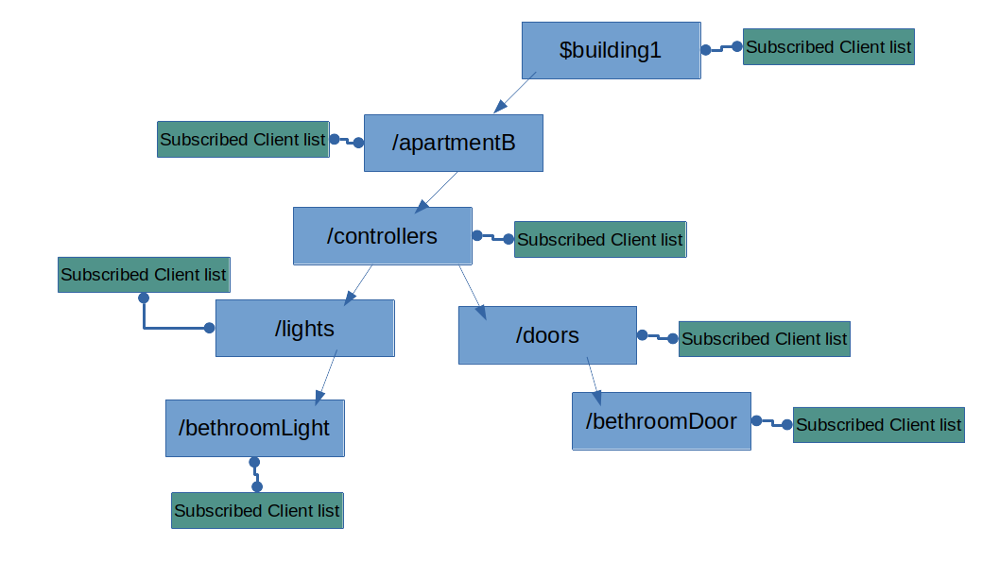

# EmbeddedMqttBroker

This is a **Mqtt broker** developed for embedded devices, in **c++** programming language, **FreeRTOS**, **arduino core** and tested in an **Esp32**. **This project include** [https://github.com/alexCajas/WrapperFreeRTOS] to implement concurrent C++ objects.

## Usage examples sketches

* **simpleMqttBroker.ino**: It show how to create, instantiate and use, a MqttBroker object.

* **httpServerAndMqttBroker.ino**: It show how to use a web server and mqtt broker in the same sketch.

## Install

* You can install this, from arduino library manager, searching **embeddedmqttbroker**.

* From platformIO using **alexcajas/EmbeddedMqttBroker@^1.0.1**

* Or downloading this repo and [https://github.com/alexCajas/WrapperFreeRTOS] manually.

## Branchs

* main: Here is the last version of the project.
* main-QOS0: Functional and tested version that only implements QOS 0.

## Can't see broker activity outputs on Serial monitor?

* Since 6e0b3b8 commit, this library use **esp32-hal-log.h** to show broker activity outputs like new clients id, topis to subscribe, to pusblish etc...

* To see this activity you need to set a **core debug level**, this level say to esp32-hal-log.h what outputs to show:
  * don't show logs: 0 (ARDUHAL_LOG_LEVEL_NONE)
  * Error logs: 1 (ARDUHAL_LOG_LEVEL_ERROR)
  * Warnings logs: 2 (ARDUHAL_LOG_LEVEL_WARM)
  * Info logs: 3 (ARDUHAL_LOG_LEVEL_INFO)
  * Debug logs: 4 (ARDUHAL_LOG_LEVEL_DEBUG)
  * Verbose logs: 5 (ARDUHAL_LOG_LEVEL_VERBOSE)

* Arduino framework only allows to set this level in compile time, for some reason if you try to set this at runtime it doesn't work.

* To set core debug level:
  * **Arduino IDE**: set using, tools/Core Debug Level
  * **VSCODE arduino extension**: add in arduino.json
  
  ~~~c++
    "buildPreferences": [
        ["build.extra_flags", "-DCORE_DEBUG_LEVEL=ARDUHAL_LOG_LEVEL_INFO"]
    ]
  ~~~

  * **Platformio**: add in build_flags
  
  ~~~yaml
  [env:esp32]
  platform = espressif32
  framework = arduino
  board = esp32dev
  lib_deps = 
          alexcajas/WrapperFreeRTOS @ ^1.0.1
          alexcajas/EmbeddedMqttBroker @ 1.0.4-qos0
  build_flags = -DCORE_DEBUG_LEVEL=ARDUHAL_LOG_LEVEL_INFO
  ~~~

---

## Table of contents

* 1. [A Little discussion about efficiency](#id1)

  * 1.1. [How to listen a mqtt packet from a connected client?](#id2)

  * 1.2. [How to publish a mqtt packet to all interested connected clients?](#id3)

  * 1.3. [Wildcards match](#id4)

* 2. [Implementacion of this project](#id5)

* 3. [Max number of open tcp sockets at the same time on esp32](#id6)

* 4. [Understanding Mqtt packets](#id7)

* 5. [Current features and limitations](#id10)

* 6. [Features to implement in future versions of this project](#id8)

* 7. [Bibliography](#id9)

---

## 1. A Little discussion about efficiency 

### 1.1 How to listen a mqtt packet from a connected client? 

* Mqtt protocol is an application protocol, implemented over TCP/IP transport protocol.

* Tcp socket is the abstraction that connects two TCP/IP clients and by extension, two mqtt clients, in this case, a broker and a mqttClient. There is a socket in the broker connected to the socket of a mqtt client.

* The common and inefficient way to listen for an incoming packet is to iterate through a list of TCP-connected sockets and ask each socket if it has a new mqtt packet.

* This method is not time efficient, because it is of order **O(n)**, that is, if you have a broker that is connected to **n = 1000** clients, you spend **1000 time units** iterating through all sockets, and if you have **n = 1000000** you spend **1000000 time units**, for example, if all mqtt clients publish a topic at the same time, broker processes the first message that arrives at **time 1**, and the last one, is processed at **time 1000000**, **it is very slow**.

* In other programming languages ​​like java or python, for example, it's not a problem, because they can use libraries which exploit the parallel execution features of your computer unit, like vectorization of data and instructions, or threads for process the list of TCP-connected clients. With these libraries all arriving mqtt packets are processed almost at the same time.

* In C++ it can find the OpenOMP library. This library exploit the parallel features of your computer unit, but is not availabe for FreeRTOS yet.  

* So the alternative way to increase the time efficiency using FreeRTOS, is to use a concurrent tasks for each client, it is, each task will listen its own tcp socket in parallel to all other tasks.

* With this method the broker can listen to all connected mqtt clients, at the same time. The time efficiency here, is of order O(1), using the above example, broker processes all messages that arrive at time 1. The main problem of this method is the memory consumed by each task, but is the most time efficient method.  

* This problem, time vs memory consumed, is a constant in programming developments, sometimes you need to save as much memory as possible, but sacrificing cpu time, other times, you need to be very fast, sacrificing memory, but usually, you need to reach to a balance between cpu time efficiency and memory consumed.

### 1.2 How to publish a mqtt packet to all interested connected clients? 

* As above, it is possible to iterate through all clients one by one, the problem here is that the broker or listens an arriving mqtt packet or sends a mqtt packet, but can't do both at the same time.

* In this case, if there are many clients sending mqtt packets, there will be a lot of delay between publishing a mqtt packet and the new incoming mqtt packet, because when a mqtt packet arrives, the broker:
  * will iterate throught all clients, asking each client if it is subscribed to the topic.
  
  * If a client is subscribed to the topic, the broker publishes the arrived packet to this client.
  
  * And while all this is happening, broker can't listen to new mqtt packets because it is asking to a client or it is publishing a mqttpacket.

* The ideal would be publish the packet to all clients at the same time, while broker doesn't stop to listen for new mqtt packets.
  
* But if broker publishes the packet to all clients at the same time, and many clients are sending a "publish mqtt packet" to the broker at the same time, it is seen that it is necessary some way to coordinate the listening and the publishing.

* Is easy to see many solutions to this problem, the using of mailbox mutex. In high levels development, this mailbox is automatically resize so as not to fill up with messages, and usaully, there is a mailbox for each client.

* In this case, the solution is, to create a mailbox of messages to publish, all mqttClients objects in the borker will have a mailbox, and when a mqtt publish packet arrive:

  * one of these mqttClients objects receive this packet
  * this object iterates through all mqttClients, putting the received packet in their mailboxes.

* With this solution, the notifying mqttClient doesn't stop to resend packets, just puts the message in the mailbox of each client and continues.

* In parallel, each client that has a new mqtt packet in his mailbox, checks if it is subscribed to the topic and resends the packet over his tcp connection if it so.

* The main problem with the mailbox solution, is that in an embebed system, the mailbox has a fixed size and is acceded in concurrence, with a mutex, in the practice, if the mailbox is mutexed because is full of messages, and a task wants to put a mqtt publish message into the mailbox, this task must be suspended untill the mailbox has free access, and this task can't listen his tcp connection while it is suspended, the suspended client will not be able to listen or publish mqtt packets!.  

* Other common way is use Event Delegation Model GRASP pattern, in this model an object generates an event and other objects listen this event.

* The object that generates the event, has a list of listeners objects, and when it needs to notify the event, the object iterate through his list, notifying the event. In other programming languages, this iteration can be realized in parallel.

* Note that here is still an iteration through all objects, but if this object is an event listener to, this object can be notifiyed that an event has ocurred at the same time that this object is notifiying his events to his listeners.

* If the mqtt broker is implemented like a vector of MqttClients objects (where each object represents a mqtt client with his tcp connection) connected to this broker, and:
  * it is delegated to MqttClient object the responasibility of listen his tcp socket

  * and if it is implement each MqttClient object like an generates event object and event object listener 

* then, each MqttClient can listen to other MqttClients publish events, at the same time that each MqttClient can notify his publish event, and each MqttClient can do that in parallel!.

* It is true that when a MqttClient object received from his tpc connection a "mqtt publish packet", the object stop to listen his socket to notify this event to the others MqttClients objects, but it is stoped only his socket, the other tcp connections are still listened. 

* For other way, is a big step, go from stop the listen of all tcp connections to stop only the connection that needs to resend a "mqtt publish packet".

* Event delegation model introduce other problem, in a mqtt broker system, a client can be interested in his own publish topic, for what? it is depend, but the Mqtt protocol doesn't prohibit it.

* In this situation, a MqttClient object has to insert himself into his listeners list, and each MqttClient object has a pointer to each MqttClient connected to the broker, (it is seen in vector "listeners"), the same structure is present in all mqttClients!, it is very inefficient in memory.

* The memory efficiency here, is order of O(n\*n), in a system with only 10 mqtt clients, the broker store in memory, 10\*10 pointers to his MqttClients objects, 10 pointers for each MqttClient object, in an embebed system with 100 clients, the system will crash!.

* The not common way, but the efficent way, is to use a prefix tree structure to store, the topics and a pointer to interested clients, if you keep in mind an usual hierarchy of topics, you can visualize it like a tree, for example, two topics:
  * $building1/apartmentB/controllers/lights/bethroomLight
  * $building1/apartmentB/controllers/doors/bethroomDoor

* can be modeled as:

* If a list of interested clients is associated to each topic level, it gets quick access to interested clients, when someone publish a topic, the efficiency of getting clients, depends on the topic's level, that is, in order of O(n), where "n" is the numbers of levels.

* But, why is more efficient than iteration method?, it is true that these two methods are in order of O(n), but it is easy to get 400, 500 or 1000 clients in a medium size system, and it is very rare find more than 10 or 12 levels in a topic, in the same system!, this is the magic of Mqtt protocol, with a few levels topics, it is build a big M2M communication system, in this case O(topics levels) is much less than O(number of clients), and therefore more efficient.

* Something similiar happends to memory usage:
  * In the worst case, all clients are interesting in all topics, if are 10 clients and, each client publish 20 topics, there will be 200 pointers of MqttClients, the memory efficiency is O(n\*t), where "n" is numbers of connected clients, and "t" the numbers of topics.
  
  * In a normal case, many clients only publish topcis, and few mqtt clients are intereting in some of this topics, and more less mqtt clients are interesting in all mqtt topics, this reduce considerably the use of memory, maybe between  O(log(n)) (that is more less than O(n)), and O(n\*log(n)),(that is more less than O(n\*n)), but depends on the specific characteristics of the project.

  * If mqtt desing best practices are used, the efficiency of prefix tree is increased, and conversely, if these mqtt design best practices are not used, the efficiency worsens, but this is true for any mqtt architecture, and for any mqtt broker. These are two article examples where you can learn mqtt desing best practices [https://docs.aws.amazon.com/whitepapers/latest/designing-mqtt-topics-aws-iot-core/mqtt-design-best-practices.html], [https://www.hivemq.com/blog/mqtt-essentials-part-5-mqtt-topics-best-practices/].
  
### 1.3 Wildcards match 

* Using a topic tree, is easy to implement Wildcards:

  * **"#"**: To match with multi level wildcard, it is only necessary to add the interested mqtt client, to a list in the node that represent the final level of topic, for example:
  
    * $building1/#
    * In this case, it is only necessary, to add the mqttClient to "$building1" node.

  * **"+"**: To match with single level wildcard, it is necessary, to add the subscribed client, in all son nodes of this level:
    * $building1/apartmentB/controllers/+/bethroom
    * In this case, it is necessary to add the client in "lights/bethroom" node and "doors/bethroom" node.

* In this two cases, the match efficiency are in order of O(n), where "n" is the number of topic leves, but as number of topics levels is very small, it can approximate O(n) to O(1).

* Someone can think to use a hashmap like map<hasid,TopicSubscribed>, where:
  * "TopicSubscribed" is the object that has all mqttClients subscirbed to this topic, and
  
  * "hasid" is the index of the topic.
  
* This idea doesn't reduce the memory to store a reference to the mqttClients when we need public a topic, because like before, there will be a copy of the reference of the interested mqttClient in the corresponding map entry.

* But this idea reduce considerably, the time to spend searching a match with a topic published, and a mqttClient subscribed to this topic, the efficiency here is in order of O(1), for any numbers of topic level.

* But the problem here, is how to implement wildcards!, think about the next idea, if it is necessary an unique hash number for each topic, you need process the topic to calculate his hash, ok, it is easy, is the same that password encrypting sofware do, it is easy find some algorithm to do that.

* But, if some client want to subscribe to the topic $building1/apartmentB/controllers/**+**/bethroom, how do you do match with the topics $building1/apartmentB/controllers/lights/bethroom and $building1/apartmentB/controllers/doors/bethroom if you have an unique hash for each topic?.

* The solutions for this problem use a lot of memory and worsens the time to spend to find a match, to orders of O(n) in a favorable case, and order of O(n\*n) in worst cases, and are complex mathematical problem to solve.

* For these reasons, a hasmap structure is not the recommend structure to use to implement wildcars, considering that it doesn't improve the efficiency of Tree and with a Tree is easy to implement wildcards.

## 2. Implementacion of this project 

* I would like this project to be as educational, general, scalable and reusable, in others architectures, as possible for this reason, I use:
  
  * GRASP Patterns.
  * Solutions that reach to a balance between consumed memory and cpu time, because it covers the needs of most user of a Mqtt broker, for that I use:
  
    * One task for each tcp socket.
    * Topics prefix Tree.
    * WiFi Arduino libraries, and FreeRtos utils, because they are compatibles with many microcontrollers, and are the most used by the community.

## 3. Max number of open tcp sockets at the same time on esp32 

* **Esp32 can only keep 10 tcp sockets open at the same time**, this limitation comes from lwIP library, a small implementation of TCP/IP protocol, wich aims to reduce ram usage [https://github.com/espressif/esp-lwip]. Esp32 has enough ram memory to open more tcp sockets, especially if it is used the wrover B model, but to day, lwIP library doesn't support more connections. You can try set lwIp options and test if Esp32 can accept more tcp connections, you can find these options probably in /home/yourUser/.arduino15/packages/esp32/hardware/esp32/1.0.5/tools/sdk/include/lwip/lwip/opt.h

* This is the reason why a broker, or any server based on TCP/IP, like HTTP server, implement in Esp32 only can listen to 9 clients (1 socket is needed to listen for new clients).

* This isue: https://github.com/espressif/esp-idf/issues/4900 of espressif github page, talks about 16 tcp sockets, probably there was a version of lwIp library which accepts 16 tcp connections.

## 4. Understanding Mqtt packets: 

* Mqtt packets have three parts:
  * fixed header.
  * variable header.
  * PayLoad.

* **Fixed header** has 1 byte for control and 1 to 4 bytes to inform to packet length. The **Most Significant Bit** of packet length field, is used as a flag to inform that the next byte is part of the lengt packet bytes, for example:
  
  * control + 1 byte length packet:
    * control: 00000001  
    * packet lengt: **0**0000110 (6 in binary)
  
  * control + 2 bytes for packet length:
    * control: 00000001
    * first byte of packet lengt: **1**0010000  
    * second byte of packet length: **0**0000001.

* With this encoding, 1 byte for length packet can encoding 127 bytes because we have 1 bit for flag and 7 bits for length.

* Other example: packet with 128 bytes size:
  * control: 0000001
  * first length byte: **1**000000
  * second length byte: **0**0000001
  * in hex encode, it is:  0x01|0x80|0x01,
  * in dec: 1|128|1.

* Other example: packet with 192 bytes size:
  * control: 00000001
  * first length byte: **1**1000010  
  * second length byte: **0**00000001.

* There are algorithms to encode and decode packet length size, this algorithms can be read at [http://docs.oasis-open.org/mqtt/mqtt/v3.1.1/os/mqtt-v3.1.1-os.html#_Toc398718023].

* **Variable header** has, fields like topic, payload or client id, that have variable lenght size, the size of this fields, is encoded always with two bytes, and the decode is simple, it is only necessary concatenate this bytes, the first byte is the **Most Significant byte** (MSb) and the second is the **Less Significant byte** (LSb).
  
## 5. Current features and limitations 

* **QOS**:
  * only QOS 0

* **topics**:
  * You can store 2.828KBytes in topics
  * One character is 1 byte, so You can use 2.828K characters
  
* **max payload length**: 50KBytes.
  
* on average each MqttClient object size 20KBytes.

* It can re-sent **1000 topics** in **0.723 seconds**, **10000 topics** in **7.40 seconds**.

## 6. Features to implement in future versions of this project 

* QOS 1.
* QOS 2.  

## 7. Bibliography 

* [http://docs.oasis-open.org/mqtt/mqtt/v3.1.1/os/mqtt-v3.1.1-os.html]
* [https://docs.espressif.com/projects/esp-idf/en/latest/esp32/api-guides/lwip.html]
* [https://github.com/jscheiny/Streams]
* [https://docs.aws.amazon.com/whitepapers/latest/designing-mqtt-topics-aws-iot-core/mqtt-design-best-practices.html]
* [https://www.hivemq.com/blog/mqtt-essentials-part-5-mqtt-topics-best-practices/]